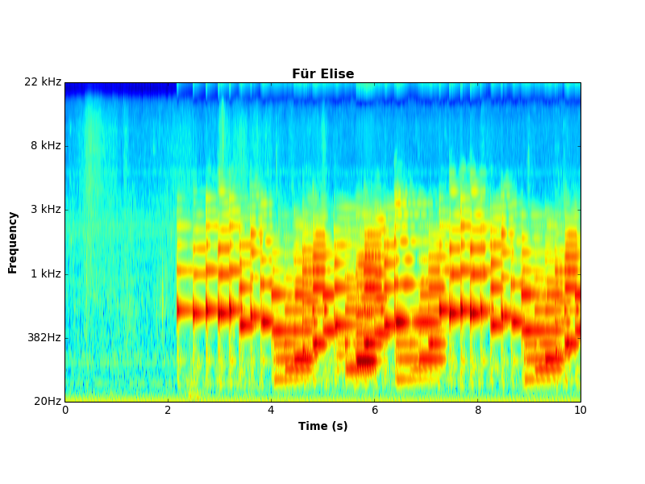

Gammatone Filterbank Toolkit
============================

*Utilities for analysing sound using perceptual models of human hearing.*

Jason Heeris, 2013

Summary
-------

This is a port of Malcolm Slaney's and Dan Ellis' gammatone filterbank MATLAB
code, detailed below, to Python 3 using Numpy and Scipy. It analyses signals by
running them through banks of gammatone filters, similar to Fourier-based
spectrogram analysis.



Installation
------------

You can install directly from this git repository using:

```text
pip install git+https://github.com/detly/gammatone.git
```

...or you can clone the git repository however you prefer, and do:

```text
pip install .
```

...or:

```
python setup.py install
```

...from the cloned tree.

### Dependencies

 - numpy
 - scipy
 - nose
 - mock
 - matplotlib
 - scikits.audiolab >= 0.11.0.p3.1

Because the authoritative version of `audiolab` hasn't been ported to Python 3
yet, you will need to install [my port](https://github.com/detly/audiolab).

Using the Code
--------------

See the [API documentation](http://detly.github.io/gammatone/). For a
demonstration, you can run:

```text
python -m gammatone samples/FurElise.ogg -d 10
```

...to see a gammatone-gram of the first ten seconds of Beethoven's "Für Elise."
If you've installed via `pip` or `setup.py install`, you should also be able to
just run:

```text
gammatone samples/FurElise.ogg -d 10
```

A note of warning: if you don't use the `-d` flag, the gammatone analysis will
consume a *lot* of memory.

Basis
-----

This project is based on research into how humans perceive audio, originally
published by Malcolm Slaney:

[Malcolm Slaney (1998) "Auditory Toolbox Version 2", Technical Report #1998-010,
Interval Research Corporation, 1998.](
http://cobweb.ecn.purdue.edu/~malcolm/interval/1998-010/
)

Slaney's report describes a way of modelling how the human ear perceives,
emphasises and separates different frequencies of sound. A series of gammatone
filters are constructed whose width increases with increasing centre frequency,
and this bank of filters is applied to a time-domain signal. The result of this
is a spectrum that should represent the human experience of sound better than,
say, a Fourier-domain spectrum would.

A gammatone filter has an impulse response that is a sine wave multiplied by a
gamma distribution function. It is a common approach to modelling the auditory
system.

The gammatone filterbank approach can be considered analogous (but not
equivalent) to a discrete Fourier transform where the frequency axis is
logarithmic. For example, a series of notes spaced an octave apart would appear
to be roughly linearly spaced; or a sound that was distributed across the same
linear frequency range would appear to have more spread at lower frequencies.

The real goal of this toolkit is to allow easy computation of the gammatone
equivalent of a spectrogram — a time-varying spectrum of energy over audible
frequencies based on a gammatone filterbank.

Slaney demonstrated his research with an initial implementation in MATLAB. This
implementation was later extended by Dan Ellis, who found a way to approximate a
"gammatone-gram" by using the fast Fourier transform. Ellis' code calculates a
matrix of weights that can be applied to the output of a FFT so that a
Fourier-based spectrogram can easily be transformed into such an approximation.

Ellis' code and documentation is here: [Gammatone-like spectrograms](
http://labrosa.ee.columbia.edu/matlab/gammatonegram/
)

Interest
--------

I became interested in this because of my background in science communication
and my general interest in the teaching of signal processing. I find that the
spectrogram approach to visualising signals is adequate for illustrating
abstract systems or the mathematical properties of transforms, but bears little
correspondence to a person's own experience of sound. If someone wants to see
what their favourite piece of music "looks like," a normal Fourier transform
based spectrogram is actually quite a poor way to visualise it. Features of the
audio seem to be oddly spaced or unnaturally emphasised or de-emphasised
depending on where they are in the frequency domain.

The gammatone filterbank approach seems to be closer to what someone might
intuitively expect a visualisation of sound to look like, and can help develop
an intuition about alternative representations of signals.

Verifying the port
------------------

Since this is a port of existing MATLAB code, I've written tests to verify the
Python implementation against the original code. These tests aren't unit tests,
but they do generally test single functions. Running the tests has the same
workflow:

  1. Run the scripts in the `test_generation` directory. This will create a
     `.mat` file containing test data in `tests/data`.
     
  2. Run `nosetest3` in the top level directory. This will find and run all the
     tests in the `tests` directory.

Although I'm usually loathe to check in generated files to version control, I'm
willing to make an exception for the `.mat` files containing the test data. My
reasoning is that they represent the decoupling of my code from the MATLAB code,
and if the two projects were separated, they would be considered a part of the
Python code, not the original MATLAB code.

